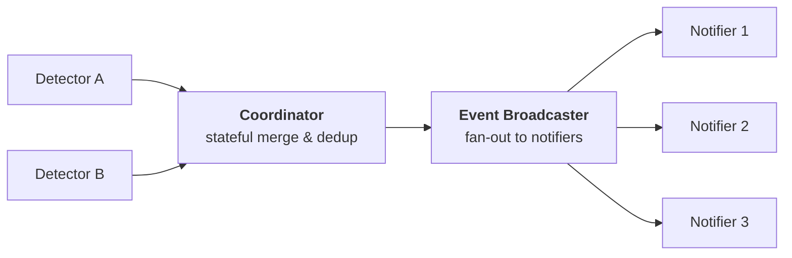

# Architecture

CameraCoordinator is a Go library that detects when webcams on a Linux machine start or stop recording. It is consumed by a binary in `cmd/camera-coordinator`.

## Components

- **`CameraDetector`** (`camera_detector.go`) — interface for a detection source. Implementations call `Run(ctx)` to start and expose raw `CameraEvent` values on a channel returned by `Events()`.
  - **`EBPFVb2IoctlStreamDetector`** (`camera_detector_vb2_ioctl.go`) — the main implementation. Attaches kprobes to `vb2_ioctl_streamon`, `vb2_ioctl_streamoff`, and `vb2_fop_release` via the `github.com/cilium/ebpf` library. Events are delivered from kernel space through a BPF ring buffer.
- **`CameraCoordinator`** (`camera_coordinator.go`) — aggregates one or more `CameraDetector` instances into a single event stream. Tracks active detectors per device and deduplicates: emits one `RecordingOn` when the first detector goes active for a device, and one `RecordingOff` when the last detector goes inactive.
- **`EventBroadcaster`** (`event_broadcaster.go`) — fans out a single coordinator `Events()` channel to N output channels, one per notifier.
- **`Notifier`** (`notifier.go`) — interface for event sinks. Implementations receive a `<-chan CameraEvent` and process events until the channel is closed or `ctx` is cancelled.
  - **`PrintNotifier`** — logs each event via `slog`.
  - **`ScriptNotifier`** (`notifier_script.go`) — executes a configurable shell script on `RecordingOn` and/or `RecordingOff` events.
- **V4L2 utilities** (`v4l2_camera_discoverer.go`) — queries device capabilities via the `VIDIOC_QUERYCAP` ioctl, used to filter eBPF events to V4L2 capture devices only and to discover devices.

Events flow through the system in a linear chain. Each box represents a logical component, not a specific variable or goroutine.

